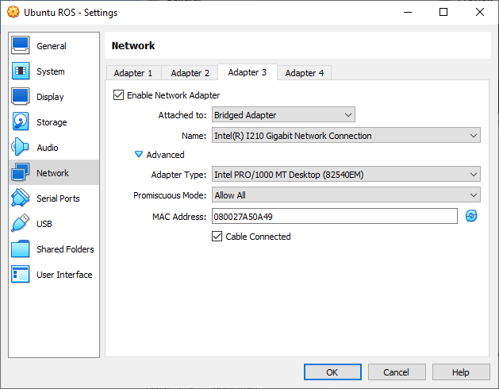

# Virtual Reality Interface for Robot Teleoperation and Environment Visualisation
## Setup
- Set up SteamVR room scale (or standing but that is untested) It is a lot easier to set up in Windows.
- Install Unity 2020.2 or higher (This project is 2022.2.3 but I would recommended latest LTS for your own projects.)
- If in windows, set up Ubuntu Virtual Machine (VM). Alternatively you can run Ubuntu natively on another machine.
- Follow this guide for installing Ubuntu 22.04 in VirtualBox: <https://ubuntu.com/tutorials/how-to-run-ubuntu-desktop-on-a-virtual-machine-using-virtualbox>

Once installed, you can optionally install virtualbox utils in Ubuntu to allow for shared folders:
```sh
sudo apt install virtualbox-guest-utils
```

Install ROS2 Humble: Ubuntu (Debian packages) — [ROS 2 Documentation: Humble documentation](https://docs.ros.org/en/humble/Installation/Ubuntu-Install-Debians.html)
### Network Settings
Power off the VM, and go to network settings. Change it to be attached to "Bridged Adapter", set Name to be the adapter connected to your network. Open up advanced, and set Promiscuous Mode to be "Allow All"



### ROS Packages and Setup
Start up the VM again, and create a new ROS 2 Workspace
Creating a workspace — ROS 2 Documentation: Humble documentation

Install the Turtlebot3, Navigation2, SLAM_Toolbox, Compressed_Image_Transport packages
```sh
sudo apt update
sudo apt install ros-humble-turtlebot3 
sudo apt install ros-humble-turtlebot3-msgs
sudo apt install ros-humble-turtlebot3-gazebo

sudo apt install ros-humble-navigation2
sudo apt install ros-humble-nav2-bringup

sudo apt install ros-humble-slam-toolbox

sudo apt install ros-humble-compressed-image-transport
```

Also add the following to the ~/.bashrc file and restart the terminal
```sh
source /opt/ros/humble/setup.bash
export ROS_DOMAIN_ID=30 #TURTLEBOT3
export TURTLEBOT3_MODEL=burger
```

To install the ROS-TCP Endpoint
```sh
cd ~/ros2_ws/src
git clone -b main-ros2 https://github.com/Unity-Technologies/ROS-TCP-Endpoint.git
cd ..
```

#### Gazebo Classic Camera Simulation for Turtlebot3
Warning these files require root permissions to edit, and will be overwritten when updating certain packages

Open `/opt/ros/humble/share/turtlebot3_gazebo/models/turtlebot3_burger/model.sdf`
And add this to the end before `</model>`
```xml
<joint name="camera_joint" type="fixed">
  <parent>base_link</parent>
  <child>camera_link</child>
  <pose>0 0 0.171 0 0 0</pose>
  <axis>
    <xyz>0 0 1</xyz>
  </axis>
</joint>


<link name="camera_link">
  <pose>0.05 0 0.17 0 0 0</pose>
  <collision name="camera_collision">
    <pose>0 0 0 0 0 0</pose>
    <geometry>
      <box>
        <size>0.05 0.05 0.05</size>
      </box>
    </geometry>
  </collision>

  <visual name="camera_visual">
    <pose>0 0 0 0 0 0</pose>
    <geometry>
      <box>
        <size>0.05 0.06 0.05</size>
      </box>
    </geometry>
  </visual>

  <inertial>
    <mass>1e-5</mass>
    <pose>0 0 0 0 0 0</pose>
    <inertia>
      <ixx>1e-6</ixx>
      <ixy>0</ixy>
      <ixz>0</ixz>
      <iyy>1e-6</iyy>
      <iyz>0</iyz>
      <izz>1e-6</izz>
    </inertia>
  </inertial>

  <sensor type="camera" name="camera">
    <update_rate>30.0</update_rate>
    <camera name="head">
      <horizontal_fov>1.3962634</horizontal_fov>
      <image>
        <width>800</width>
        <height>800</height>
        <format>R8G8B8</format>
      </image>
      <clip>
        <near>0.02</near>
        <far>300</far>
      </clip>
      <noise>
        <type>gaussian</type>
        <!-- Noise is sampled independently per pixel on each frame.
            That pixel's noise value is added to each of its color
            channels, which at that point lie in the range [0,1]. -->
        <mean>0.0</mean>
        <stddev>0.007</stddev>
      </noise>
    </camera>
    <plugin name="camera_controller" filename="libgazebo_ros_camera.so">
      <alwaysOn>true</alwaysOn>
      <updateRate>0.0</updateRate>
      <cameraName>turtlebot3_burger/camera</cameraName>
      <imageTopicName>image_raw</imageTopicName>
      <cameraInfoTopicName>camera_info</cameraInfoTopicName>
      <frameName>camera_link</frameName>
      <hackBaseline>0.07</hackBaseline>
      <distortionK1>0.0</distortionK1>
      <distortionK2>0.0</distortionK2>
      <distortionK3>0.0</distortionK3>
      <distortionT1>0.0</distortionT1>
      <distortionT2>0.0</distortionT2>
    </plugin>
  </sensor>
</link>
   ```

Open `/opt/ros/humble/share/turtlebot3_gazebo/urdf/turtlebot3_burger.urdf` and add the following before `</robot>`
```xml  
<joint name="camera_joint" type="fixed">
  <axis xyz="0 1 0" />
  <origin xyz="0.05 0 0.165" rpy="0 0 0"/>
  <parent link="base_link"/>
  <child link="camera_link"/>
</joint>

<!-- Camera -->
<link name="camera_link">
  <collision>
    <origin xyz="0 0 0" rpy="0 0 0"/>
    <geometry>
        <box size="0.05 0.05 0.05"/>
    </geometry>
  </collision>

  <visual>
    <origin xyz="0 0 0" rpy="0 0 0"/>
    <geometry>
      <box size="0.05 0.05 0.05"/>
    </geometry>
    <material name="red"/>
  </visual>


  <inertial>
    <mass value="1e-5" />
    <origin xyz="0 0 0" rpy="0 0 0"/>
    <inertia ixx="1e-6" ixy="0" ixz="0" iyy="1e-6" iyz="0" izz="1e-6" />
  </inertial>
</link>
```
### Unity Setup
To run this project, clone the repository, and open the project in Unity. Open the scene `Assets\_VR Robotics\Scenes\Base Scene.unity`
To connect it to the ROS VM, you have to tell the ROS TCP Connector the IP address which corresponds to the Ubuntu VM. To find that out run `hostname -I` in the VM.
Then in Unity under Robotics->ROS Settings set the protocol to ROS2 and set the IP address. Within the Base Scene, open the ROS Tools gameobject and select the ROSConnectionPrefab.
Then in the inspector set the ROS IP Address.

> **_NOTE:_** To set up your own project that can connect to the VM, you need to install the [ROS-TCP-Connector](https://github.com/Unity-Technologies/ROS-TCP-Connector)
> I would also recommend installing the Visualisations package in the same repository. Then you can follow similar steps as above to set the IP address. For setting up VR,
> you can follow the [Unity Manual VR guide](https://docs.unity3d.com/Manual/VROverview.html), and I would recommend installing the
> [XR Interaction Toolkit](https://docs.unity3d.com/Packages/com.unity.xr.interaction.toolkit@2.3/manual/index.html) too.

## Running the Interface with Simulation

Start up the Ubuntu VM if it is not already running.
There are four commands to run for simulating the robot with slam and navigation

To run the ROS TCP Endpoint run the following replacing `<IP ADDRESS>` with the IP address found above using `hostname -I`.
```sh
cd ~/ros2_ws
source install/setup.bash (May not exist so ignore it on first run)
colcon build
source install/setup.bash
ros2 run ros_tcp_endpoint default_server_endpoint –ros-args -p ROS_IP:=<IP ADDRESS>
```

Launch the Gazebo Simulation of the turtlebot with either of the following commands in a new terminal:
```
ros2 launch turtlebot3_gazebo turtlebot3_house.launch.py
```
or
```
ros2 launch turtlebot3_gazebo turtlebot3_world.launch.py
```

Launch SLAM Toolbox in a new terminal:
```
ros2 launch slam_toolbox online_async_launch.py use_sim_time:=True
```
Or launch Cartographer
```
ros2 launch turtlebot3_cartographer cartographer.launch.py use_sim_time:=True
```

Launch Navigation2 in a new terminal:
```
ros2 launch turtlebot3_navigation2 navigation2.launch.py use_sim_time:=True
```

To launch the unity project, make sure the ROS Connector Script has the right IP address, connect the VR headset and click play

## Running the Interface with an Actual Turtlebot3
### Setup on Turtlebot3
Do the initial setup of the Turtlebot3 following the official [quick start guide](https://emanual.robotis.com/docs/en/platform/turtlebot3/quick-start/)
> Make sure to select Humble at the top so that you are following the correct guide. It is also may be worth doing the PC setup on a native installation
> of Ubuntu during the initial setup of the Turtlebot3. For connecting to the Turtlebot3, the VM should be sufficient.

Install camera_ros on the Raspberry PI
```sh
sudo apt install ros-humble-camera-ros
```
Create a launch file `picamera.launch.py` on the Turtlebot3 and put the following code in it.
```python
from launch import LaunchDescription
from launch.actions import DeclareLaunchArgument
from launch.substitutions import LaunchConfiguration, TextSubstitution

from launch_ros.actions import Node

def generate_launch_description():
	format_launch_arg = DeclareLaunchArgument(
    	'format', default_value=TextSubstitution(text='RGB888')
	)
	width_launch_arg = DeclareLaunchArgument(
    	'width', default_value=TextSubstitution(text='800')
	)
	height_launch_arg = DeclareLaunchArgument(
    	'height', default_value=TextSubstitution(text='800')
	)

	return LaunchDescription([
    	format_launch_arg,
    	width_launch_arg,
    	height_launch_arg,
    	Node(
        	package='camera_ros',
        	executable='camera_node',
        	name='camera',
        	parameters=[{
            	'format': LaunchConfiguration('format'),
            	'width': LaunchConfiguration('width'),
            	'height': LaunchConfiguration('height'),
        	}]
    	),
	])
```
### Running the Nodes
#### Turtlebot3 
Either in seperate terminals or in seperate tmux panes run the following commands:
```sh
ros2 launch turtlebot3_bringup robot.launch.py
ros2 launch ./picamera.launch.py
```
#### VM or Remote PC
Launch SLAM Toolbox in a new terminal:
```
ros2 launch slam_toolbox online_async_launch.py use_sim_time:=True
```
Or launch Cartographer
```
ros2 launch turtlebot3_cartographer cartographer.launch.py use_sim_time:=True
```

Launch Navigation2 in a new terminal:
```
ros2 launch turtlebot3_navigation2 navigation2.launch.py use_sim_time:=True
```

To run the ROS TCP Endpoint in a new terminal run the following replacing <IP ADDRESS> with the IP address found above using `hostname -I`.
```sh
cd ~/ros2_ws
source install/setup.bash (May not exist so ignore it on first run)
colcon build
source install/setup.bash
ros2 run ros_tcp_endpoint default_server_endpoint –ros-args -p ROS_IP:=<IP ADDRESS>
```

